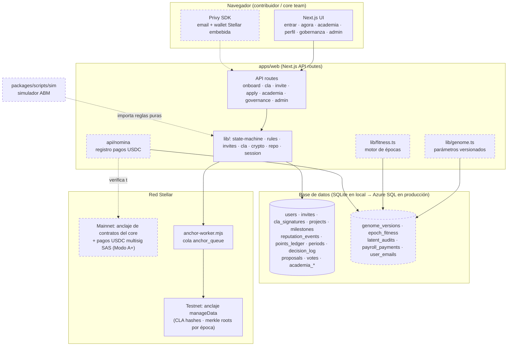

# Plano 01 · Arquitectura (estado actual → objetivo v1.1)

El estado actual detallado está en `docs/architecture.md`. Este plano muestra el sistema completo y qué añade v1.1 (líneas punteadas = nuevo).

## Principios que no se negocian

1. **Toda la DB detrás de `lib/db.ts`** (swap de motor sin tocar lógica). Hoy: SQLite en local, **Azure SQL** en producción (driver `mssql`, autenticación por managed identity). Este principio es lo que hizo que cambiar de motor costara minutos y no un refactor.
2. **Funciones puras para las reglas** (`state-machine`, `rules`, `fitness`, `genome`): testeables y reutilizables por el simulador.
3. **Append-only donde importa**: reputación, puntos, genoma, decision log — los saldos se derivan, nunca se mutan.
4. **La app no custodia fondos.** Los pagos se ejecutan fuera (multisig SAS) y la app registra + verifica contra Horizon. La custodia on-chain llega con el escrow de M2, auditado.
5. **Anclaje ≠ contrato**: en M1 la integridad se prueba con `manageData` (barato, seguro); los contratos Soroban entran en M2 (ver plano 04).
