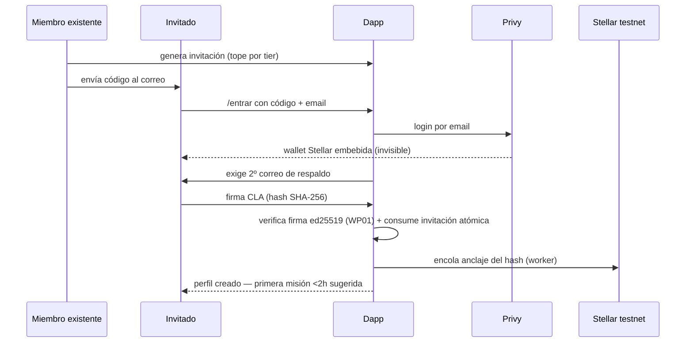
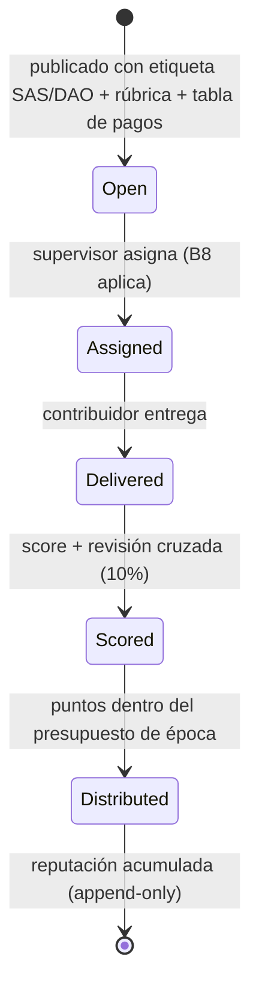
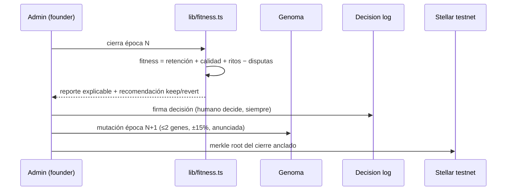
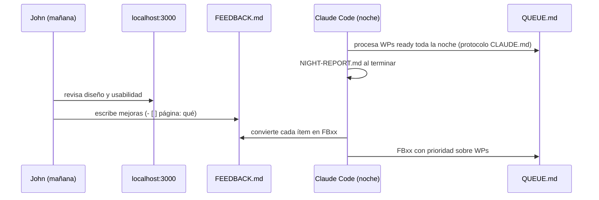

# Plano 02 · Interacciones (los 5 flujos que definen el producto)

## 1. Onboarding (la puerta)

Regla de diseño: sin invitación no hay login; sin CLA no hay primer bounty; sin 2º correo no hay perfil (continuidad si sale de la org).

## 2. Ciclo de un bounty (el flywheel)

## 3. Cierre de época (la generación evolutiva)

## 4. Feedback nocturno (el loop con Claude Code)

## 5. Nómina del core (Modo A+, tras gate legal)

Contrato PDF firmado → hash anclado en mainnet → pago USDC desde multisig SAS (fuera de la app) → admin registra tx en `/nomina` → la app verifica contra Horizon → el pagado ve contrato→hash→tx enlazados. Nadie más ve montos.
