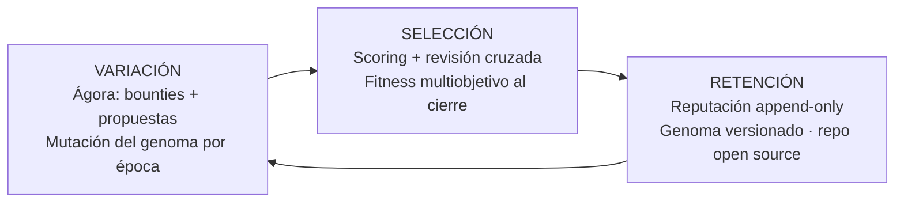
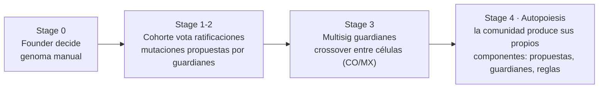

# Plano 03 · Evolución (el sistema como organismo)

Fundamento completo: doc 16. Este plano es el mapa operativo.

## El bucle evolutivo

## El genoma (qué muta y qué jamás)

| Muta (vive en genome_versions) | JAMÁS muta |
|---|---|
| Presupuesto de época, caps y rendimientos de Academia | El CLA y todo lo legal |
| Topes de invitación por tier | Historial: reputación, puntos, decision log |
| Pesos del fitness (meta-parámetros) | Épocas cerradas (nada retroactivo) |
| Split de pagos, umbrales de tiers (cuando entren) | La regla "entregas, no personas" |
| Cadencia de ritos, tamaño de primera misión | El derecho a portar tu identidad y progreso |

## Reglas del motor

1. Cada época = una generación; mínimo una decisión de mutación (incluso "sin cambios", explícita).
2. Mutación: ≤2 genes, ±15%, anunciada antes de la época, reversible (append-only).
3. Selección: fitness explicable → recomendación → **el humano firma** (Dietvorst).
4. Mutaciones grandes pasan primero por el simulador ABM (`packages/scripts/sim`).
5. Trimestral: auditoría de funciones latentes (Merton) → disfunciones → propuestas de mutación.

## Horizonte evolutivo (stages del Plan Maestro, en clave de sistema)

Criterio de madurez (doc 16): el sistema está vivo cuando produce sus propios componentes sin el founder. La descentralización es la recompensa de la madurez, no el punto de partida.
