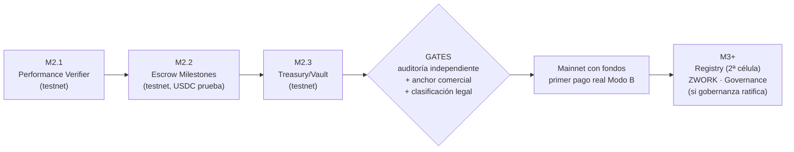

# Plano 04 · Smart contracts — cuáles, dónde se usan, cuándo entran

Principio (fork F1 + Plan Maestro §7.3): **un contrato solo existe cuando custodiar o verificar on-chain aporta algo que el anclaje simple no da.** En M1 no hay contratos por diseño: `manageData` prueba integridad y existencia sin custodiar nada. Los contratos entran en M2, y mainnet-con-fondos solo tras auditoría independiente.

## Mapa: flujo de la dapp → mecanismo hoy → contrato futuro

| Flujo | Hoy (M1, testnet) | M2 (contrato Soroban) | Mainnet-con-fondos |
|---|---|---|---|
| Firma del CLA | Hash anclado con manageData | Igual (no necesita contrato) | Igual |
| Contratos del core (nómina) | Hash anclado en mainnet (no mueve dinero) | Igual | Igual |
| Cierre de época (scores) | Merkle root anclado con manageData | **Performance Verifier**: root + verificación de pruebas individuales | Tras auditoría |
| Pagos por hitos (proyectos SAS) | Modo A: fiat/manual con tabla 20/70/10 | **Escrow de Milestones** en testnet | Gates: auditoría + anchor + legal |
| Tesoro DAO (30%) | Registro off-chain + decision log | **Treasury/Vault** en testnet (multisig + timelock) | Tras auditoría; migración, no upgrade |
| Registro de células/orgs | Tabla en DB | **Registry/Factory** (una instancia por célula) | Con la 2ª célula (México) |
| Puntos ZWORK | Ledger off-chain no transferible | Igual (deliberado) | **Token ZWORK** solo si la gobernanza lo ratifica (M3+) |
| Votación | Off-chain con anclaje del resultado | Igual + snapshot de reputación | **Governance** on-chain (M3+, Stage 3) |

## Los contratos, uno a uno

### 1. Performance Verifier (M2 — el primero que se construye)
**Qué hace:** guarda el merkle root de cada cierre de época; expone `verify(proof, leaf)` para que cualquier contribuidor pruebe su score/reputación sin exponer los datos de otros.
**Dónde se usa:** cierre de época (plano 02, flujo 3); reputación portable (un tercero puede verificar el historial de un contribuidor).
**Por qué contrato y no manageData:** manageData prueba que el root existe; el Verifier permite *verificar pruebas individuales on-chain* — la base de la reputación portable y del escrow.
**Estado:** no existe. Diseño heredable del patrón Harmony (zelena skill). `packages/contracts/` reservado.

### 2. Escrow de Milestones / Disbursement (M2 — el corazón del Modo B)
**Qué hace:** implementa on-chain los estados del doc 11: `Funded → InProgress → Delivered → Approved → Claimable → Claimed`, con rama `Disputed` que congela solo ese hito. Fondeo 100% upfront; anticipo 20%; retención 10%; multiplicador de calidad 0–200bp; `recover_undistributed` y `sweep_expired_claims`; patrón CEI anti-reentrancy.
**Dónde se usa:** proyectos SAS del Ágora con presupuesto en dinero (LUMA, CREDIFONO cuando pasen a Modo B).
**Integraciones evaluadas (no dependencias):** Blend para yield del escrow ocioso (regla: si Blend se congela, el yield degrada a cero pero los pagos NUNCA se bloquean — el escrow no depende del yield); Stellar Private Payments (X-Ray, ZK Groth16) para que los montos no sean públicos.
**Estado:** diseñado (doc 11 + security review §3); no implementado.

### 3. Treasury / Vault (M2 testnet, mainnet tras auditoría)
**Qué hace:** custodia el 30% del treasury DAO; salidas solo por propuesta aprobada + timelock; multisig de guardianes; línea de presupuesto founder/causas (tope 10% anual, Reglamento).
**Política crítica (Plan Maestro §7.3):** migración (v2 + mover estado + apagar v1), nunca upgrade-en-caliente — es la superficie más peligrosa.
**Estado:** `packages/contracts/treasury/` reservado, vacío.

### 4. Registry / Factory (con la 2ª célula)
**Qué hace:** registro de organizaciones/células; despliega instancias de Verifier+Escrow por célula; admin con dual-firma; TTL 365 días con plan de renovación (riesgo documentado en security review).
**Dónde se usa:** expansión México (Horizonte 2); crossover del genoma entre células.
**Estado:** existe el patrón probado en el lado Harmony (Factory en testnet); se adapta.

### 5. Token ZWORK (M3+, condicional)
Hoy los puntos son deliberadamente off-chain y no transferibles (B12: presupuesto de época, cero especulación). El token solo existe si la gobernanza madura lo ratifica, con la reputación — no el token — dando el voto. `packages/contracts/token/` reservado. **No es un WP: es una decisión de gobernanza.**

### 6. Governance (M3+, Stage 3)
Voto on-chain con snapshot de reputación de ventana móvil, umbrales 50/66%, timelock de tesoro. Hasta entonces: votación off-chain con resultado anclado (ya implementada en M1).

## Orden de construcción y gates

**Prerrequisitos técnicos antes de M2.1:** entorno Rust + stellar-cli (el sandbox original no lo tenía — fork F1); quién firma el root = multisig, no una llave (security review); domain separators por red; plan de renovación de TTL de storage.

**Regla de oro:** ningún contrato custodia fondos reales sin auditoría independiente. El anclaje (que no custodia) puede ir a mainnet desde hoy; el escrow no.
