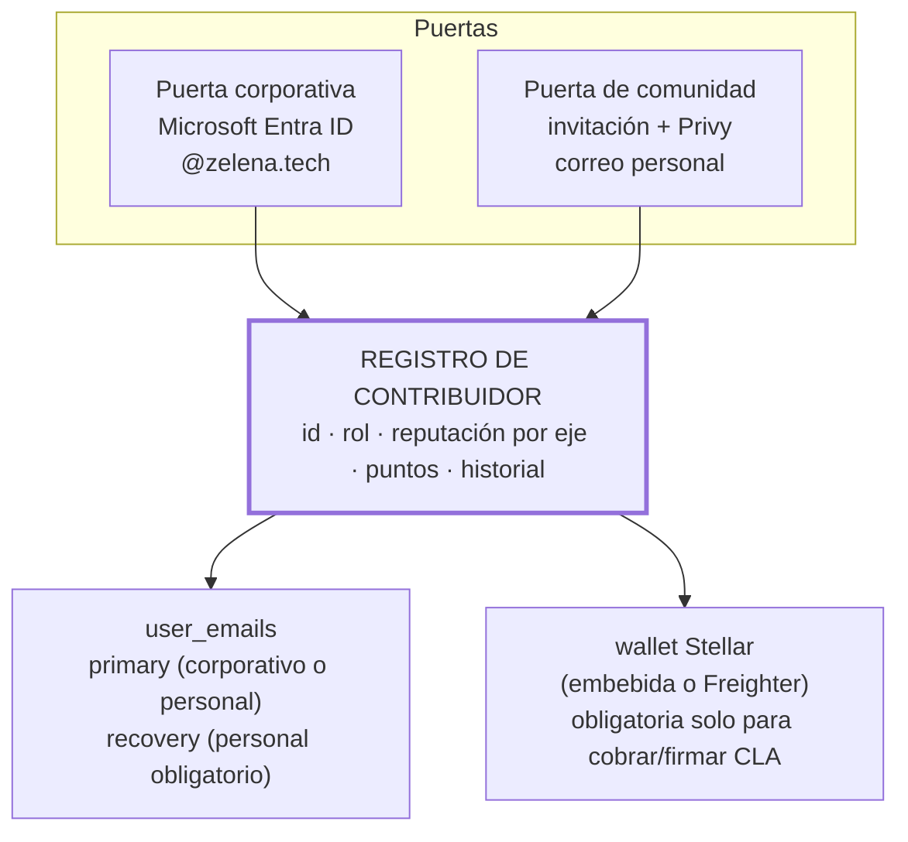

# Plano 05 · Identidad dual y las tres fases

Regla operativa de John: **organizar → automatizar → descentralizar.** Este plano muestra cómo una sola base de datos sirve a las tres fases sin reescribirse.

## Identidad: dos puertas, un registro

**El principio (doc 15 §2):** la identidad es el registro, no el correo. Por eso:

- Un miembro del core que sale de la organización pierde la puerta corporativa, **no su progreso**: el correo de respaldo y la wallet siguen siendo suyos, y sigue entrando como contribuidor de comunidad.
- Un voluntario que después se contrata no crea cuenta nueva: se le vincula el corporativo al mismo registro.
- La wallet se exige solo cuando hace falta (firmar CLA, recibir puntos o pagos), no para ver tus tareas del día.

## Las tres fases sobre la misma base

| | Organizar (v1 — ahora) | Automatizar (v2) | Descentralizar (v3+) |
|---|---|---|---|
| **Quién entra** | Core team con Entra ID | + primeros voluntarios | Cohorte Génesis completa |
| **Qué se ve** | Asignaciones del día, proyectos, dashboard, bloqueos | Digest automático, agenda desde Graph, recordatorios | Ágora, bounties, gobernanza |
| **Cómo se mide** | Estados y check-ins | Scoring semiautomático desde la actividad | Fitness por época + revisión cruzada |
| **Cómo se paga** | Fuera de la app (nómina actual) | Nómina Modo A+ registrada y verificada (WP10) | Escrow on-chain M2 tras gates |
| **Quién decide** | John | John con datos | Guardianes y votación por reputación |
| **WPs** | WP13-16 | WP04, WP10, Graph, notificaciones | WP06, M2 contratos, cohorte |

Cada fase reusa lo anterior: los check-ins de la fase 1 alimentan el fitness de la fase 3; las asignaciones internas se publican como bounties sin cambiar de modelo; la reputación empieza a acumularse desde el primer día de la fase 1 — cuando llegue la DAO, el core team ya tiene historial.

## Por qué el dashboard vive dentro de la dapp

Poner el seguimiento interno en una herramienta aparte obligaría a migrar personas, historial y reputación cuando llegue la DAO — y en la práctica esa migración no ocurre nunca. Al vivir en la misma base: una sola auth, un solo modelo de estados, un solo lugar donde el trabajo se convierte en reputación. **La DAO no se "lanza" algún día: se destapa cuando el sistema interno ya funciona.**
