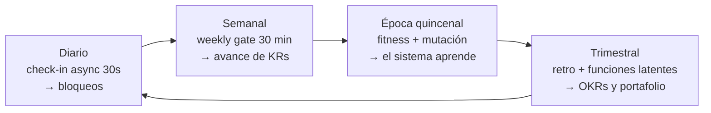

# Plano 06 · Diseño organizacional: ágil aplicado a Zelena (4 personas + agentes)

Los marcos de agilidad y DevOps están escritos para organizaciones de cientos de personas. Aplicarlos literalmente a un equipo de 4 es el error clásico: se copia la ceremonia y se pierde el principio. Este plano traduce cada idea a la escala real de Zelena y marca lo que NO aplica todavía.

## 1. Equipos verticales — el principio sí, la estructura no (aún)

La recomendación de equipos verticales (full-stack, dueños de una capacidad de negocio de punta a punta) es correcta. Pero con 4 personas **no puedes formar varios equipos: eres UN equipo vertical.** Y eso ya es una ventaja: no tienes silos que romper.

Lo que sí se aplica desde hoy:

| Principio vertical | Cómo se aplica con 4 personas |
|---|---|
| Propiedad de punta a punta | Cada WP/asignación tiene **un** responsable que la lleva de la idea a producción. Prohibido el "yo hice mi parte". |
| Minimizar transferencias | El agente hace el draft, el humano audita: la transferencia es humano↔agente, no humano↔humano. |
| Contexto de negocio en el equipo | Los entornos por cliente (WP17) ponen el contexto del cliente al alcance de quien ejecuta. |
| La arquitectura refleja la estructura (Conway) | 4 personas + agentes → monolito modular bien organizado, no microservicios. Los microservicios son la ley de Conway de una organización que no tienes. |
| Equipos de plataforma | No hay equipo de plataforma: **la plataforma son las skills, los specs y el loop de agentes.** |

**Cuándo formar un segundo equipo vertical:** cuando una línea (WMS o DAO) tenga trabajo estable para 3+ personas y las asignaciones entre líneas dejen de competir. Hoy no es el caso. Forzarlo ahora crearía los silos que la agilidad busca eliminar.

## 2. De jerarquía a red — la versión honesta

El material propone distribuir la toma de decisiones. En Zelena eso ya está codificado en el stage machine de la DAO (Stage 0 → 4): la autoridad migra **por fórmula, no por voluntad**. Hoy estás en Stage 0 y eso es correcto durante la validación.

Lo aplicable ahora, sin esperar a la DAO:

- **Límites de decisión explícitos**: cada spec define qué decide el owner solo y qué escala a John (`needs_founder` en el dashboard es literalmente la ruta de escalación).
- **De controlador a entrenador**: tu rol en el weekly gate es preguntar contra criterios, no revisar código. El playbook ya lo define.
- **Decisiones delegadas por defecto**: si no está marcado `needs_founder`, el owner decide. El silencio no es veto.

## 3. De proceso a resultados

Ya implementado y por implementar:

- Criterios de aceptación observables en cada spec (resultado, no tarea) ✅
- Retro con poder real de cambiar el proceso: la mutación de época (WP08) **es** eso — el equipo cambia las reglas del sistema, no solo se queja de ellas ✅
- OKRs con resultados numéricos (WP18) ⏳
- Métricas centradas en cliente: por definir en los OKRs del trimestre

## 4. Objetivos SMART y OKRs mapeados a Zelena

Los ejemplos de DevOps (frecuencia de despliegue, MTTR, trabajo no planeado) se traducen a las dos realidades de Zelena:

**Candidatos para el WMS** (lo que paga las cuentas):
- Reducir el tiempo de despliegue de un cliente nuevo de 1 semana a 3 días
- Reducir el trabajo no planeado (soporte reactivo) del X% actual al 30% del tiempo del equipo
- Cero parches manuales en producción de clientes

**Candidatos para la DAO** (lo que se valida):
- Retención de la cohorte ≥60% a 8 semanas (K3, ya definido)
- 3 clientes evaluando el sistema de incentivos con datos reales

Todos necesitan **baseline medido antes de fijar el target** — por eso WP18 lo exige en el formulario. Sin baseline, el OKR es una intención.

## 5. Cadencias: lo que ya existe, sin ceremonias nuevas

Cuatro ritmos, ninguna reunión de reporte. El material recomienda ciclos cortos por agilidad, velocidad de aprendizaje y motivación; la época quincenal es exactamente eso, con la ventaja de que en Zelena el ciclo corto **también muta las reglas** (doc 16).

## 6. Lo que NO aplica todavía (y por qué importa decirlo)

| Del material | Por qué no aplica hoy |
|---|---|
| Varios equipos verticales | No hay gente suficiente. Sería teatro organizacional. |
| Equipos de plataforma dedicados | Los agentes y las skills cumplen esa función. |
| Rutas de escalación multinivel | Con 4 personas, la escalación es: hablar con John. |
| Métricas DORA completas | Requieren CI/CD maduro (WP06 y siguientes). Empieza por frecuencia de despliegue y trabajo no planeado. |
| Transformación cultural de arriba abajo | No hay cultura entrenchada que transformar. La ventaja de ser pequeño: se instala la cultura correcta desde el inicio, no se rescata. |

**El riesgo real de este material en una empresa de 4 personas es adoptar el vocabulario sin el cambio.** La prueba de que la agilidad es real no es tener OKRs y retros: es que el equipo pueda cambiar una regla del sistema sin pedir permiso. Eso ya lo tienes codificado en la mutación de época.
