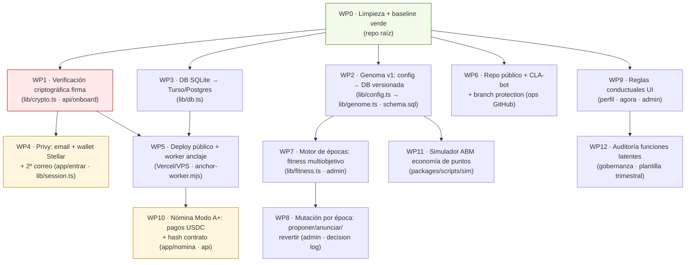

# Workflow Graph — Dapp v1.1 "Génesis Evolutiva"

Ingeniería derivada de: Ultraplan (doc 15) + Fundamento Teórico (doc 16) + security-review.md.
Método: cada mejora es un **work package (WP)** = un spec con criterios de aceptación. Las **aristas** son dependencias técnicas (dos WPs que tocan el mismo módulo no se paralelizan). El orden topológico produce **olas**: dentro de una ola, los WPs corren en paralelo (un agente por WP, el humano owner audita).

## El grafo

Rojo = bloqueante de seguridad. Amarillo = tiene gate externo (spike Privy / consulta legal).

## Olas de ejecución

| Ola | WPs en paralelo | Cuándo |
|---|---|---|
| 0 | WP0 | Día 1 |
| 1 | WP1 · WP2 · WP3 · WP6 | Días 1–2 |
| 2 | WP4 · WP5 · WP9 | Días 3–4 |
| 3 | WP7 · WP10 · WP11 | Días 5–7 (WP10 tras gate legal) |
| 4 | WP8 · WP12 | Semana 2 |

**Regla de paralelización:** WP2 y WP7 tocan `rules.ts`/`config.ts` → secuenciales. WP1 (crypto/onboard), WP3 (db.ts) y WP6 (ops) no comparten archivos → misma ola, agentes en paralelo (worktrees o ramas).

## Work packages (spec resumido — el spec completo se genera con la skill `delegar`)

### WP0 · Limpieza + baseline verde
Borrar duplicados (`apps/web/src/app/` viejo, `middleware.ts`, `node_modules` interno — ver docs/decisions-pending.md). `npm test` 20/20 y build verde. Tag `v0.1-genesis`.
**Owner:** Dev 1 · **Agente:** ejecuta limpieza y corre suite. **Criterio:** tests verdes en repo limpio, tag creado.

### WP1 · Verificación criptográfica de la firma (Alta #1) 🔴
El servidor valida la firma ed25519 del challenge contra la pubkey declarada (hoy confía en el cliente). Spec en `docs/security-review.md`.
**Archivos:** `lib/crypto.ts`, `app/api/onboard`, `app/api/cla`.
**Owner:** Dev 1 · **Agente:** draft de verificación + tests de firma inválida/replay. **Criterio:** onboarding rechaza firma inválida; test de replay entre redes (domain separator) pasa.

### WP2 · Genoma v1 (doc 16 §3)
Extraer de `config.ts` los parámetros evolutivos (EPOCH_BUDGET, ACADEMIA_*, TIER_INVITE_CAPS, pesos futuros de scoring, split 20/70/10) a tabla `genome_epochs` (version, params JSON, epoch, published_at, decision_log_ref). Lectura tipada `lib/genome.ts`. Los valores actuales = genoma v1, publicado en el decision log.
**Owner:** Dev 1 · **Agente:** migración + tipos + tests. **Criterio:** la app lee todos los parámetros del genoma activo; cambiar un valor requiere insertar versión nueva referenciando una decisión; nada retroactivo.

### WP3 · Migración DB (Turso/Postgres)
Capa ya aislada en `lib/db.ts` (driver dual). Instrucciones en `docs/deploy.md`.
**Owner:** Dev 2 · **Criterio:** suite completa verde contra Turso; seed reproducible.

### WP4 · Identidad Privy 🟡 (timebox 1 día)
Login por correo (invitación ligada al email), wallet Stellar embebida, segundo correo obligatorio antes de completar perfil, identidad = registro contribuidor (doc 15 §2). Freighter queda como opción avanzada. Si el spike no cierra en 1 día → fallback flujo actual, Privy pasa a semana 2.
**Archivos:** `app/entrar`, `lib/session.ts`, `app/api/onboard`, `app/api/invite/verify`.
**Owner:** Dev 1 · **Criterio:** invitado entra solo con email, wallet creada invisible, 2º correo vinculado, CLA anclado; core team con @zelena.tech + personal.

### WP5 · Deploy público + worker
Vercel + Turso (o VPS), `SESSION_SECRET`/`FOUNDER_WALLET`, rate-limit a storage compartido si serverless (hallazgo del review), `anchor-worker.mjs` corriendo.
**Owner:** Dev 2 · **Criterio:** URL pública, flujo completo end-to-end, hash de CLA anclado en testnet visible.

### WP6 · Repo público + blindaje PI
CLA-bot bloquea merge sin firma, CODEOWNERS (rutas críticas: contracts, lib/genome, lib/fitness, api), branch protection. Archivos de gobernanza ya existen (CLA.md, CONTRIBUTING.md, LICENSE).
**Owner:** John (org GitHub) + Dev 2 · **Criterio:** PR externo sin CLA no puede mergear (K6 de M1).

### WP7 · Motor de épocas: fitness multiobjetivo (doc 16 §3)
Al cierre de época: calcular fitness = f(retención K3, calidad media aprobada, participación en ritos, −tasa de disputas). Comparar con época anterior → recomendación keep/revert. Registro en decision log.
**Archivos:** `lib/fitness.ts` (nuevo, puro y testeable), `lib/rules.ts`, `app/admin`.
**Owner:** Dev 1 · **Agente:** implementación + tests con datos sintéticos. **Criterio:** cierre de época produce reporte de fitness firmado por founder; recomendación explicable (regla 4: el algoritmo propone, el humano firma).

### WP8 · Mutación por época
UI admin: proponer mutación (1–2 genes, ±10–15%), anuncio visible a la cohorte ANTES de que la época empiece, aplicación como nueva versión del genoma, reversión en un click.
**Owner:** Dev 1 · **Criterio:** mutación anunciada→aplicada→revertible; nunca afecta épocas cerradas.

### WP9 · Reglas conductuales UI (doc 16 §4)
(1) Progreso propio junto a todo ranking. (2) Etiquetas: "hito no aprobado", nunca "bajo desempeño" — auditar copys. (3) Verificar que ningún flujo confisca puntos ganados (test que lo pruebe).
**Archivos:** `app/perfil`, `app/agora`, `app/admin`.
**Owner:** Dev 2 + QA · **Criterio:** checklist de las 3 reglas verificado por QA; test anti-confiscación en suite.

### WP10 · Nómina Modo A+ 🟡 (gate: consulta legal — doc 15 §3)
Registro de pagos del core: monto USDC, tx hash de Stellar mainnet, hash del contrato anclado, periodo. Vista privada para core team.
**Archivos:** `app/nomina` (nuevo), `app/api/nomina`, schema.
**Owner:** Dev 2 · **Criterio:** cada pago enlaza contrato→hash→tx verificable; visible solo para el pagado y admin.

### WP11 · Simulador ABM (doc 16 §3, salvaguarda 3)
`packages/scripts/sim`: agentes-contribuidores con estrategias (cooperador, oportunista, farmer), corren N épocas sintéticas contra un genoma dado. Se usa ANTES de mutaciones grandes.
**Owner:** Dev 1 + John (diseño de estrategias) · **Criterio:** simular 1.000 épocas <1 min; reporte de emisión de puntos, Gini de reputación y vectores de farming.

### WP12 · Auditoría de funciones latentes (doc 16, salvaguarda 1)
Plantilla trimestral (¿qué produce esta mecánica que no buscábamos? ¿funcional para quién?) + registro en `app/gobernanza`. La disfunción detectada entra como propuesta de mutación.
**Owner:** John + QA · **Criterio:** primera auditoría registrada al cierre de la época 3.

## Cadencia de operación del grafo

1. Cada WP se convierte en spec completo con la skill `delegar` antes de asignarse.
2. Un agente por WP en paralelo dentro de la ola (ramas/worktrees); el humano owner audita el draft.
3. Gate de QA contra los criterios del WP — no opiniones (Definition of Done del playbook).
4. Al cerrar una ola: merge ordenado, suite verde, siguiente ola.
5. El grafo se actualiza en este archivo; el tablero se alimenta del CSV de import.
