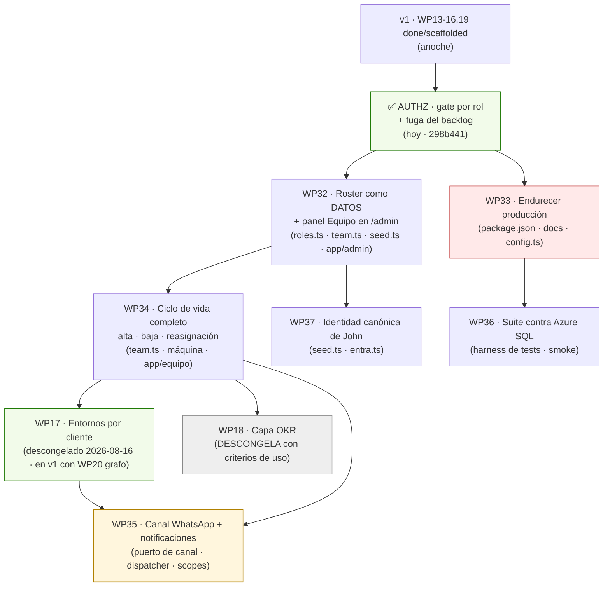

# Workflow Graph — v1.2 "Roles, no personas"

Derivado de: `docs/specs/AUDITORIA-v1.md` (27 hallazgos) + la visión de John del 30-jul (bot de WhatsApp, líderes que consultan y reportan bugs).

> **Estado (fusión 2026-09-30).** Los IDs de esta release se **renumeraron**: usaba WP20–WP26, que chocaban con los
> specs WP20–WP30 de la línea desplegada, y WP31 ya es `docs/specs/WP31-herramienta-talento-ritos.md`.
> WP20→**WP32**, WP21→**WP33**, WP22→**WP34**, WP23→**WP35**, WP24→**WP36**, WP25→**WP37**, WP26→**WP38**,
> capa async→**WP39**. Los nombres de rama (`wp/20-roster`, …) no cambian. Desde la fusión, WP17 (entornos por
> cliente) y WP20 (grafo de operación) están **dentro de v1** (John, 2026-08-16) y los **recordatorios de SLA por
> Telegram** entran en alcance (John, 2026-09-30). La cola operativa es `docs/specs/QUEUE.md`.

Método, igual que `workflow-v1.1.md`: cada mejora es un **WP** con criterios de aceptación binarios. Las **aristas son dependencias de archivos** — dos WPs que tocan el mismo módulo no se paralelizan. El orden topológico produce **olas**; dentro de una ola, un loop autónomo por WP en worktree aislado, y merge ordenado con suite verde antes de la siguiente.

> **Lección de la ola de anoche, incorporada:** correr WPs en paralelo no es solo velocidad — es **detección**. El bug del `CREATE INDEX` de WP16 lo encontró WP13 al pisar su código. Pero cuatro agentes de golpe agotaron el presupuesto de sesión y mataron a un verificador. **Regla nueva: máximo 2 WPs por ola, y el verificador adversarial corre en una invocación aparte, no en la misma.**

---

## El principio que gobierna esta iteración

**El sistema se diseña para ROLES, no para personas.**

Que Vale sea hoy la líder de proyectos y el gate de calidad no puede significar que el sistema esté cableado a Vale. Si mañana entra María o Andrea a ese rol, deben poder hacer **todo** lo que hace Vale **sin que nadie toque código**: es una operación de datos (cambiar un rol), no un PR.

Criterio de verificación del principio, y es binario:

> **Prueba de la persona nueva.** Dar de alta a alguien, hacerle supervisora, asignarle trabajo importado del CSV, que el bot la reconozca, y luego darle de baja reasignando su trabajo — todo desde la interfaz, sin un solo `git commit`. Mientras esa prueba no pase, el principio es una aspiración, no una propiedad del sistema.

Corolario que también es ley: **el mismo diseño aplica al founder.** Si el gate de admin es "la wallet de John", el sistema está cableado a John — que es exactamente el bug que se arregló hoy.

---

## El grafo

Verde = hecho o ya dentro de v1 (WP17). Rojo = bloquea exponer una URL. Amarillo = tiene gate externo (cuenta Meta + decisión de fase). Gris = congelado hasta cumplir criterios de USO.

## Olas de ejecución

| Ola | WPs en paralelo | Por qué juntos | Cuándo |
|---|---|---|---|
| **0** | ✅ AUTHZ | hecho hoy | — |
| **1** | **WP33** · **WP32** | WP33 toca `package.json`+docs, WP32 toca `roles.ts`/`team.ts`/`app/admin` → disjuntos | hoy / mañana |
| **2** | **WP34** · **WP36** | WP34 toca el módulo equipo, WP36 solo el harness de tests → disjuntos | tras ola 1 |
| **3** | **WP37** | toca `seed.ts` y `entra.ts`, que WP32 ya movió → secuencial | tras ola 1 |
| **4** | WP18 | solo si se cumplen los criterios de uso de v1 (WP17 ya entró en v1, 2026-08-16) | v1.1 |
| **5** | WP35 | necesita WP17 (clientes) + WP34 (ciclo de vida) | fase automatizar |

**Regla de paralelización:** `roles.ts` es el archivo más disputado del repo (lo consumen team, entra, dashboard, bot). Cualquier WP que lo toque va **solo** en su ola.

---

## WP32 · Roster como datos + panel de Equipo 🔴 *el corazón del principio*

Cierra: A-01, D1-03, D1-04, D1-06, D1-08.

**Problema.** `TEAM_ROSTER` es una constante de código y `seedTeamRoster` la **re-impone sobre la base en cada arranque**. Un `UPDATE` para hacer supervisora a María se revierte al reiniciar. Los 6 nombres, sus alias y sus dominios son código.

**Alcance.**
- Columnas nuevas en `users`: `slug`, `aliases` (JSON), `domain`, `expected_email`.
- `seedTeamRoster` pasa a **insert-if-missing**: nunca más `UPDATE` de filas existentes. `TEAM_ROSTER` queda como semilla inicial, no como autoridad.
- **Panel "Equipo" en `/admin`** (gated por `adminActor`): listar personas, cambiar `role`, dar/quitar `is_supervisor`, editar dominio y `expected_email`, marcar `alumni`. Cada cambio deja entrada en `decision_log`.
- El importador CSV resuelve `Assignee` contra la **base** (display_name + aliases), no contra la constante.
- El bot genera los nombres del system prompt y del schema de la herramienta desde `listTeamMembers(db)` en runtime.

**NO-alcance.** Permisos granulares/scopes (eso es WP35). Invitaciones de equipo por correo. Jerarquías o reportes de línea.

**Criterios de aceptación.**
- [ ] Dar de alta a "María" desde `/admin`, hacerla supervisora, y que vea el dashboard — **sin reiniciar y sin tocar código**.
- [ ] Reiniciar la app y comprobar que **el cambio persiste** (test que fija que el seed no sobreescribe filas existentes).
- [ ] Importar un CSV con "Maria" en `Assignee` → resuelve a su fila, no la rechaza.
- [ ] Quitarle la supervisión a Vale desde el panel; persiste tras reinicio.
- [ ] El bot, preguntado por el equipo, incluye a María sin haber recompilado.
- [ ] Cada cambio de rol queda en `decision_log` con quién y cuándo.

**Owner:** Fausto (modelo) + David (panel) · **Tamaño:** L

---

## WP33 · Endurecer producción antes de exponer la URL 🔴

Cierra: D3-05, D3-06, D3-07.

**Alcance.**
- Subir `next` a la última 14.2.x parcheada (≥14.2.25), correr `npm audit` y la suite completa.
- Corregir `DESPLIEGUE-V1.md`: A1 gana `NEXTAUTH_SECRET` y `NEXTAUTH_URL`; A3 gana `TELEGRAM_WEBHOOK_SECRET` "también en local"; actualizar "77 tests" → el número real.
- Corregir `WP16-deploy-azure.md`: "Postgres" → "Azure SQL (`mssql`)" en RESULTADO ESPERADO y en backups.
- Revisar que la app **no arranca en producción** sin `SESSION_SECRET`, `FOUNDER_WALLET` y `STELLAR_NETWORK=testnet` (ya implementado: añadir el test que lo fije).

**Criterios de aceptación.**
- [ ] `npm audit` sin vulnerabilidades critical ni high, o cada excepción justificada por escrito.
- [ ] Suite 100% verde tras el bump.
- [ ] Un lector nuevo puede seguir A1/A3 y encender los flags sin preguntar nada.
- [ ] Cero ocurrencias de "Postgres" como motor de producción en `docs/`.

**Owner:** Fausto · **Tamaño:** S

---

## WP34 · Ciclo de vida completo: alta, baja y reasignación

Cierra: D2-03, D2-04, D2-05, D1-09.

**Problema.** La baja no existe como operación de producto, una persona `alumni` **sigue contando para siempre** en el denominador de la salud de ritos, y el trabajo en vuelo de quien se va queda huérfano.

**Alcance.**
- `listTeamMembers` filtra `status = 'active'` (arregla de un golpe la salud de ritos y la carga por persona).
- Acción **"reasignar"**: evento append-only en `assignment_events` (`action='reasignar'`, destino en `reason`) + `UPDATE owner_wallet`. Disponible para founder/supervisor en `/equipo` y como comando del bot.
- Marcar `alumni` / reactivar desde el panel de WP32, con evento registrado.
- **Regla de producto (doc 16), no negociable:** dar de baja a alguien **nunca** borra ni confisca su historial, sus puntos ni su reputación. Sale del denominador de los ritos activos; no sale de la historia.
- Copy del dashboard condicionado al rol: founder → "esperando una decisión tuya"; supervisora → "esperando una decisión del founder".

**Criterios de aceptación.**
- [ ] Marcar a alguien `alumni` → desaparece de carga y del denominador del rito, **y sus puntos siguen intactos** (test anti-confiscación).
- [ ] Reasignar una pieza en vuelo → aparece en el `/equipo/hoy` del nuevo responsable, con el evento en el historial y sin perder el criterio de aceptación.
- [ ] La máquina de estados sigue pura: reasignar **no** cambia el `status`.
- [ ] Test de tabla de la matriz de estados sigue verde sin cambios.

**Owner:** Fausto · **Tamaño:** M

---

## WP36 · Hacer ejecutable la verificación contra Azure SQL

Cierra: D3-03.

**Problema.** El criterio de aceptación de WP16 dice "suite verde contra Azure SQL", pero **todos los tests abren SQLite `:memory:` hardcodeado**: no existe forma de correr la suite contra el motor real. Lo que el NIGHT-REPORT llamó "falta correrlo" es en realidad "falta escribir cómo correrlo".

**Alcance.** Lo más barato que da confianza real: `packages/scripts/smoke-azure.mjs` que, con las credenciales en el entorno, ejecute contra la instancia real el `schema.sql` traducido, el seed, el **test de carrera del consumo de invitaciones**, y un recorrido de asignación (crear → avanzar → bloquear → dashboard). Si sale barato, además un modo de vitest que inyecte la fábrica de DB respetando `DATABASE_DRIVER`.

**Criterios de aceptación.**
- [ ] Un comando documentado corre la verificación contra Azure SQL y **falla ruidoso** si el dialecto no encaja.
- [ ] El consumo atómico de invitaciones se verifica sobre el motor real, no sobre SQLite.
- [ ] `docs/deploy.md` reemplaza su sección "qué queda por verificar" por el comando real.

**Owner:** Fausto · **Tamaño:** M · Gate: credenciales de Azure (John)

---

## WP37 · Identidad canónica del founder

Cierra: D1-07, D3-04.

**Problema.** John existe **dos veces**: la wallet demo de `FOUNDER_WALLET` (seed) y `pending:john` (roster). Sus tareas del CSV viven en `pending:john`, pero su sesión de invitación es la otra wallet → **su `/equipo/hoy` sale vacío** y sus check-ins no cuentan para la salud de ritos. El código puentea entre ambas a mano (`founderTeamWallet`).

**Decisión que necesita John antes de implementar:** ¿`pending:john` es el principal canónico (y la wallet demo pasa a ser decoración del Ágora), o al revés? Recomendación: **`pending:john` canónico**, porque es donde ya vive su trabajo y donde Entra lo va a vincular.

**Criterios de aceptación.**
- [ ] Un solo registro de founder; `founderTeamWallet` desaparece o queda trivial.
- [ ] `/equipo/hoy` de John muestra sus tareas del CSV entrando por cualquiera de las dos puertas.
- [ ] Sus check-ins cuentan en la salud de ritos.
- [ ] Ningún dato existente pierde su referencia (la PK no muta: se migra o se decide, no se reescribe).

**Owner:** Fausto + decisión de John · **Tamaño:** M

---

## WP35 · Canal WhatsApp + notificaciones salientes 🟡 *fase automatizar*

Cierra: D4-01 … D4-06. **La visión de John del 30-jul.**

> "Un bot en WhatsApp que le escriba a los líderes: «ya la mejora está lista, recarga»; que puedan preguntar cosas del sistema o crear tickets de bugs, así no vivo pendiente de un montón de grupos."

**Gates que hay que atravesar ANTES de escribir código** (ninguno es técnico):
1. **Decisión de fase.** Las notificaciones son "automatizar". John ya movió la frontera para un caso (2026-09-30): los **recordatorios de SLA por Telegram** entran en alcance y están registrados en `CLAUDE.md`. Para WhatsApp y para cualquier otro aviso saliente sigue haciendo falta su decisión explícita.
2. **Cuenta de Meta.** Verificación de negocio + número dedicado. Los mensajes proactivos fuera de la ventana de 24 h van con **plantilla pre-aprobada**: el "ya está lista, recarga" *es* una plantilla, con su aprobación y su costo por conversación. *(Confirmar tarifas y tiempos vigentes con la documentación de Meta antes de presupuestar.)*
3. **WP17 descongelado** (hecho: John, 2026-08-16), porque "líderes" son de clientes y clasificar por cliente necesita el modelo de clientes.

**Alcance por etapas** (recomendación: en este orden, y cada etapa se puede parar).

- **Etapa A — desacoplar el canal (se puede hacer YA, sin Meta y sin WP17).** Extraer un tipo neutro `ReplyAction {label, action, draftId}` de la capa de negocio y un **puerto de canal** `interface ChannelPort { parse, send }`. Telegram pasa a ser una implementación de ese puerto. Es refactor puro con la suite como red: **valioso aunque WhatsApp nunca se construya**, porque hoy `bot-tools.ts` importa teclados de Telegram.
- **Etapa B — dispatcher de notificaciones.** Tabla `notifications (evento, destinatario, canal, plantilla, estado, enviado_at)` alimentada por transiciones de `assignment_events`. Con **idempotencia** (nunca dos avisos del mismo evento) y **tope por persona y día** — el sistema no existe para bombardear a nadie. Aquí es donde vive de verdad "ya está lista, recarga".
- **Etapa C — scopes y líderes.** `channel_links (channel, external_user_id, wallet|contact_id, scopes)` migrando desde `telegram_links`, y sustituir el `is_authorized` binario por scopes (`leer`, `crear_ticket`, `operar_backlog`). **Un líder de cliente no puede tener el permiso de escritura actual**, que es global.
- **Etapa D — herramientas 6 y 7.** `crear_ticket` (cliente, severidad) y `responder_pregunta` sobre **corpus cerrado** (los docs del sistema). Ojo: el guardrail de "5 herramientas y nada más" es de v1 y es una propiedad estructural testeada — subirlo a 7 es una **decisión de gobernanza que hay que escribir**, no un detalle de implementación.
- **Etapa E — transporte WhatsApp.** Webhook + verify token + plantillas. Es la parte fácil.

**NO-alcance.** Bot en grupos. Respuestas generativas libres. Cualquier telemetría de presencia (prohibido: es control por horas). Que los líderes toquen el backlog más allá de crear tickets.

**Criterios de aceptación (por etapa, binarios).**
- [ ] A: Telegram funciona idéntico detrás del puerto; `bot-tools.ts` **no importa nada de Telegram** (test de import).
- [ ] B: una transición a `Hecha` genera **exactamente un** aviso; reintentar no duplica; se respeta el tope diario.
- [ ] C: un líder con scope `leer,crear_ticket` **no** puede cerrar ni reasignar nada (test).
- [ ] D: el bot responde preguntas solo desde el corpus; fuera de él dice que no sabe.
- [ ] E: un aviso real llega a WhatsApp con plantilla aprobada, y queda registrado en `bot_actions`.

**Owner:** Fausto (puerto + dispatcher) + David (copys) + John (cuenta Meta y decisión de fase) · **Tamaño:** L (por etapas)

---

## Qué NO entra en v1.2, y por qué

- **WP18** sigue congelado. Se descongela con los **criterios de USO** de `QUEUE.md` (100% de tareas nuevas por el sistema, ≥10 asignaciones cerradas contra criterios, ≥2 reuniones reemplazadas, los 5 con asignaciones reales) — no con criterios de features. **WP17** ya se descongeló por decisión explícita de John (2026-08-16) y entra en v1 junto con WP20; los criterios de uso se cumplirán más tarde, consecuencia aceptada y registrada en `QUEUE.md`.
- **WP04 (Privy), WP06 (repo público), WP10 (nómina)** son fase descentralizar. El orden se mantiene: organizar → automatizar → descentralizar.
- **Módulo de bonos:** no se construye (decisión de John). El equipo interno corre el sistema de puntos y épocas ya construido; dinero real sobre scores solo tras 3 épocas cerradas + calibración + gate legal.

## Cadencia de operación

1. Máximo **2 WPs por ola**, en worktrees aislados, un loop por WP.
2. El **verificador adversarial corre en invocación aparte** de los implementadores (lección de hoy: agotar la sesión mata al verificador y te deja hallazgos sin confirmar).
3. Gate de calidad contra los criterios del WP — no opiniones. **El rol de gate lo ejerce quien tenga el rol, no una persona en particular**: hoy Vale; mañana quien esté en ese rol.
4. Al cerrar la ola: merge ordenado, suite completa verde, `QUEUE.md` actualizado con hash, y siguiente ola.
5. Este archivo es la fuente del grafo. `QUEUE.md` es la cola operativa.
